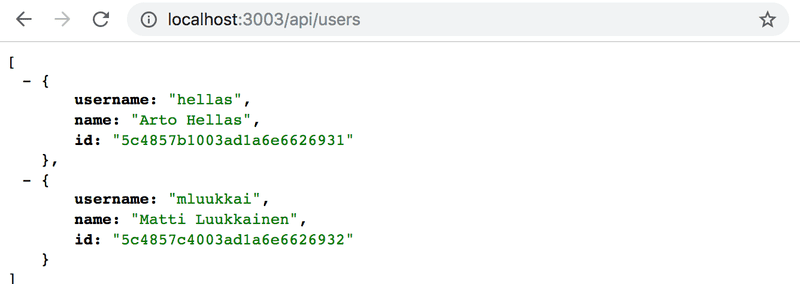
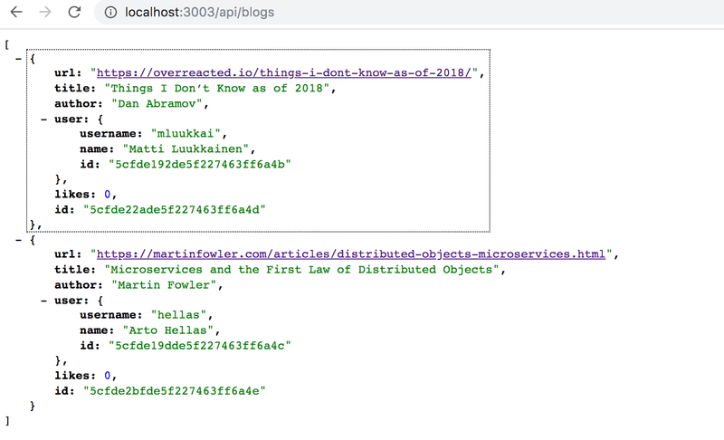
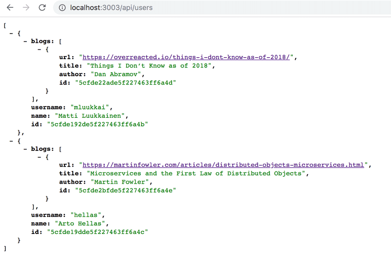

# Full Stack Open - Part 4 - Testing Express servers, user administration - Exercises


## Exercises 4.1.-4.2.

In the exercises for this part, we will be building a blog list application, that allows users to save information about interesting blogs they have stumbled across on the internet. For each listed blog we will save the author, title, URL, and amount of upvotes from users of the application.

### 4.1 Blog list, step1

Let's imagine a situation, where you receive an email that contains the following application body:

```
const express = require('express')
const app = express()
const cors = require('cors')
const mongoose = require('mongoose')

const blogSchema = new mongoose.Schema({
  title: String,
  author: String,
  url: String,
  likes: Number
})

const Blog = mongoose.model('Blog', blogSchema)

const mongoUrl = 'mongodb://localhost/bloglist'
mongoose.connect(mongoUrl)

app.use(cors())
app.use(express.json())

app.get('/api/blogs', (request, response) => {
  Blog
    .find({})
    .then(blogs => {
      response.json(blogs)
    })
})

app.post('/api/blogs', (request, response) => {
  const blog = new Blog(request.body)

  blog
    .save()
    .then(result => {
      response.status(201).json(result)
    })
})

const PORT = 3003
app.listen(PORT, () => {
  console.log(`Server running on port ${PORT}`)
})
```

Turn the application into a functioning npm project. To keep your development productive, configure the application to be executed with nodemon. You can create a new database for your application with MongoDB Atlas, or use the same database from the previous part's exercises.

Verify that it is possible to add blogs to the list with Postman or the VS Code REST client and that the application returns the added blogs at the correct endpoint.

### 4.2 Blog list, step2

Refactor the application into separate modules as shown earlier in this part of the course material.

NB refactor your application in baby steps and verify that the application works after every change you make. If you try to take a "shortcut" by refactoring many things at once, then Murphy's law will kick in and it is almost certain that something will break in your application. The "shortcut" will end up taking more time than moving forward slowly and systematically.

One best practice is to commit your code every time it is in a stable state. This makes it easy to rollback to a situation where the application still works.


## Exercises 4.3.-4.7.

Let's create a collection of helper functions that are meant to assist in dealing with the blog list. Create the functions into a file called utils/list_helper.js. Write your tests into an appropriately named test file under the tests directory.

### 4.3: helper functions and unit tests, step1

First, define a dummy function that receives an array of blog posts as a parameter and always returns the value 1. The contents of the list_helper.js file at this point should be the following:

```
const dummy = (blogs) => {
  // ...
}

module.exports = {
  dummy
}
```

Verify that your test configuration works with the following test:

```
const listHelper = require('../utils/list_helper')

test('dummy returns one', () => {
  const blogs = []

  const result = listHelper.dummy(blogs)
  expect(result).toBe(1)
})
```

### 4.4: helper functions and unit tests, step2

Define a new totalLikes function that receives a list of blog posts as a parameter. The function returns the total sum of likes in all of the blog posts.

Write appropriate tests for the function. It's recommended to put the tests inside of a describe block so that the test report output gets grouped nicely:


Defining test inputs for the function can be done like this:

```
describe('total likes', () => {
  const listWithOneBlog = [
    {
      _id: '5a422aa71b54a676234d17f8',
      title: 'Go To Statement Considered Harmful',
      author: 'Edsger W. Dijkstra',
      url: 'http://www.u.arizona.edu/~rubinson/copyright_violations/Go_To_Considered_Harmful.html',
      likes: 5,
      __v: 0
    }
  ]

  test('when list has only one blog, equals the likes of that', () => {
    const result = listHelper.totalLikes(listWithOneBlog)
    expect(result).toBe(5)
  })
})
```

If defining your own test input list of blogs is too much work, you can use the ready-made list here.

You are bound to run into problems while writing tests. Remember the things that we learned about debugging in part 3. You can print things to the console with console.log even during test execution. It is even possible to use the debugger while running tests, you can find instructions for that here.

NB: if some test is failing, then it is recommended to only run that test while you are fixing the issue. You can run a single test with the only method.

Another way of running a single test (or describe block) is to specify the name of the test to be run with the -t flag:

```
npm test -- -t 'when list has only one blog, equals the likes of that'
```

### 4.5*: helper functions and unit tests, step3

Define a new favoriteBlog function that receives a list of blogs as a parameter. The function finds out which blog has the most likes. If there are many top favorites, it is enough to return one of them.

The value returned by the function could be in the following format:

```
{
  title: "Canonical string reduction",
  author: "Edsger W. Dijkstra",
  likes: 12
}
```

NB when you are comparing objects, the toEqual method is probably what you want to use, since the toBe tries to verify that the two values are the same value, and not just that they contain the same properties.

Write the tests for this exercise inside of a new describe block. Do the same for the remaining exercises as well.

### 4.6*: helper functions and unit tests, step4

This and the next exercise are a little bit more challenging. Finishing these two exercises is not required in to advance in the course material, so it may be a good idea to return to these once you're done going through the material for this part in its entirety.

Finishing this exercise can be done without the use of additional libraries. However, this exercise is a great opportunity to learn how to use the Lodash library.

Define a function called mostBlogs that receives an array of blogs as a parameter. The function returns the author who has the largest amount of blogs. The return value also contains the number of blogs the top author has:

```
{
  author: "Robert C. Martin",
  blogs: 3
}
```

If there are many top bloggers, then it is enough to return any one of them.

### 4.7*: helper functions and unit tests, step5

Define a function called mostLikes that receives an array of blogs as its parameter. The function returns the author, whose blog posts have the largest amount of likes. The return value also contains the total number of likes that the author has received:

```
{
  author: "Edsger W. Dijkstra",
  likes: 17
}
```

If there are many top bloggers, then it is enough to show any one of them.


## Exercises 4.8.-4.12.

NB: the material uses the toContain matcher in several places to verify that an array contains a specific element. It's worth noting that the method uses the === operator for comparing and matching elements, which means that it is often not well-suited for matching objects. In most cases, the appropriate method for verifying objects in arrays is the toContainEqual matcher. However, the model solutions don't check for objects in arrays with matchers, so using the method is not required for solving the exercises.

Warning: If you find yourself using async/await and then methods in the same code, it is almost guaranteed that you are doing something wrong. Use one or the other and don't mix the two.

### 4.8: Blog list tests, step1

Use the supertest package for writing a test that makes an HTTP GET request to the /api/blogs URL. Verify that the blog list application returns the correct amount of blog posts in the JSON format.

Once the test is finished, refactor the route handler to use the async/await syntax instead of promises.

Notice that you will have to make similar changes to the code that were made in the material, like defining the test environment so that you can write tests that use separate databases.

NB: When running the tests, you may run into the following warning:


One way to get rid of this is to add to the tests directory a file teardown.js with the following content

```
module.exports = () => {
  process.exit(0)
}
```

and by extending the Jest definitions in the package.json as follows

```
{
 //...
 "jest": {
   "testEnvironment": "node",
   "globalTeardown": "./tests/teardown.js" }
}
```

NB: when you are writing your tests it is better to not execute all of your tests, only execute the ones you are working on. Read more about this here.

### 4.9: Blog list tests, step2

Write a test that verifies that the unique identifier property of the blog posts is named id, by default the database names the property _id. Verifying the existence of a property is easily done with Jest's toBeDefined matcher.

Make the required changes to the code so that it passes the test. The toJSON method discussed in part 3 is an appropriate place for defining the id parameter.

### 4.10: Blog list tests, step3

Write a test that verifies that making an HTTP POST request to the /api/blogs URL successfully creates a new blog post. At the very least, verify that the total number of blogs in the system is increased by one. You can also verify that the content of the blog post is saved correctly to the database.

Once the test is finished, refactor the operation to use async/await instead of promises.

### 4.11*: Blog list tests, step4

Write a test that verifies that if the likes property is missing from the request, it will default to the value 0. Do not test the other properties of the created blogs yet.

Make the required changes to the code so that it passes the test.

### 4.12*: Blog list tests, step5

Write tests related to creating new blogs via the /api/blogs endpoint, that verify that if the title or url properties are missing from the request data, the backend responds to the request with the status code 400 Bad Request.

Make the required changes to the code so that it passes the test.


## Exercises 4.13.-4.14.

### 4.13 Blog list expansions, step1

Implement functionality for deleting a single blog post resource.

Use the async/await syntax. Follow RESTful conventions when defining the HTTP API.

Implement tests for the functionality.

### 4.14 Blog list expansions, step2

Implement functionality for updating the information of an individual blog post.

Use async/await.

The application mostly needs to update the number of likes for a blog post. You can implement this functionality the same way that we implemented updating notes in part 3.

Implement tests for the functionality.


## Exercises 4.15.-4.23.

In the next exercises, the basics of user management will be implemented for the Bloglist application. The safest way is to follow the story from part 4 chapter User administration to the chapter Token authentication. You can of course also use your creativity.

One more warning: If you notice you are mixing async/await and then calls, it is 99% certain you are doing something wrong. Use either or, never both.

### 4.15: bloglist expansion, step3

Implement a way to create new users by doing an HTTP POST request to address api/users. Users have a username, password and name.

Do not save passwords to the database as clear text, but use the bcrypt library like we did in part 4 chapter Creating new users.

NB Some Windows users have had problems with bcrypt. If you run into problems, remove the library with command

```
npm uninstall bcrypt 
```

and install bcryptjs instead.

Implement a way to see the details of all users by doing a suitable HTTP request.

The list of users can, for example, look as follows:



### 4.16*: bloglist expansion, step4

Add a feature which adds the following restrictions to creating new users: Both username and password must be given. Both username and password must be at least 3 characters long. The username must be unique.

The operation must respond with a suitable status code and some kind of an error message if an invalid user is created.

NB Do not test password restrictions with Mongoose validations. It is not a good idea because the password received by the backend and the password hash saved to the database are not the same thing. The password length should be validated in the controller as we did in part 3 before using Mongoose validation.

Also, implement tests that ensure invalid users are not created and that an invalid add user operation returns a suitable status code and error message.

### 4.17: bloglist expansion, step5

Expand blogs so that each blog contains information on the creator of the blog.

Modify adding new blogs so that when a new blog is created, any user from the database is designated as its creator (for example the one found first). Implement this according to part 4 chapter populate. Which user is designated as the creator does not matter just yet. The functionality is finished in exercise 4.19.

Modify listing all blogs so that the creator's user information is displayed with the blog:



and listing all users also displays the blogs created by each user:



### 4.18: bloglist expansion, step6

Implement token-based authentication according to part 4 chapter Token authentication.

### 4.19: bloglist expansion, step7

Modify adding new blogs so that it is only possible if a valid token is sent with the HTTP POST request. The user identified by the token is designated as the creator of the blog.

### 4.20*: bloglist expansion, step8

This example from part 4 shows taking the token from the header with the getTokenFrom helper function.

If you used the same solution, refactor taking the token to a middleware. The middleware should take the token from the Authorization header and place it into the token field of the request object.

In other words, if you register this middleware in the app.js file before all routes

```
app.use(middleware.tokenExtractor)
```

Routes can access the token with request.token:

```
blogsRouter.post('/', async (request, response) => {
  // ..
  const decodedToken = jwt.verify(request.token, process.env.SECRET)
  // ..
})
```

Remember that a normal middleware function is a function with three parameters, that at the end calls the last parameter next to move the control to the next middleware:

```
const tokenExtractor = (request, response, next) => {
  // code that extracts the token

  next()
}
```

### 4.21*: bloglist expansion, step9

Change the delete blog operation so that a blog can be deleted only by the user who added the blog. Therefore, deleting a blog is possible only if the token sent with the request is the same as that of the blog's creator.

If deleting a blog is attempted without a token or by an invalid user, the operation should return a suitable status code.

Note that if you fetch a blog from the database,

```
const blog = await Blog.findById(...)
```

the field blog.user does not contain a string, but an Object. So if you want to compare the id of the object fetched from the database and a string id, a normal comparison operation does not work. The id fetched from the database must be parsed into a string first.

```
if ( blog.user.toString() === userid.toString() ) ...
```

### 4.22*: bloglist expansion, step10

Both the new blog creation and blog deletion need to find out the identity of the user who is doing the operation. The middleware tokenExtractor that we did in exercise 4.20 helps but still both the handlers of post and delete operations need to find out who the user holding a specific token is.

Now create a new middleware userExtractor, that finds out the user and sets it to the request object. When you register the middleware in app.js

```
app.use(middleware.userExtractor)
```

the user will be set in the field request.user:

```
blogsRouter.post('/', async (request, response) => {
  // get user from request object
  const user = request.user
  // ..
})

blogsRouter.delete('/:id', async (request, response) => {
  // get user from request object
  const user = request.user
  // ..
})
```

Note that it is possible to register a middleware only for a specific set of routes. So instead of using userExtractor with all the routes,

```
// use the middleware in all routes
app.use(userExtractor)
app.use('/api/blogs', blogsRouter)  
app.use('/api/users', usersRouter)
app.use('/api/login', loginRouter)
```

we could register it to be only executed with path /api/blogs routes:

```
// use the middleware only in /api/blogs routes
app.use('/api/blogs', userExtractor, blogsRouter)app.use('/api/users', usersRouter)
app.use('/api/login', loginRouter)
```

As can be seen, this happens by chaining multiple middlewares as the parameter of function use. It would also be possible to register a middleware only for a specific operation:

```
router.post('/', userExtractor, async (request, response) => {
  // ...
}
```

### 4.23*: bloglist expansion, step11

After adding token-based authentication the tests for adding a new blog broke down. Fix the tests. Also, write a new test to ensure adding a blog fails with the proper status code 401 Unauthorized if a token is not provided.

This is most likely useful when doing the fix.

This is the last exercise for this part of the course and it's time to push your code to GitHub and mark all of your finished exercises to the exercise submission system.

