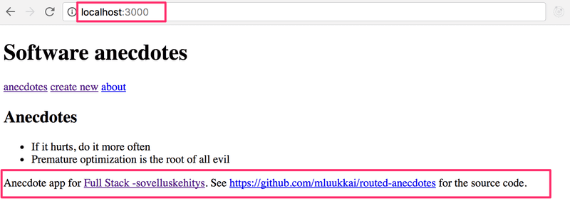
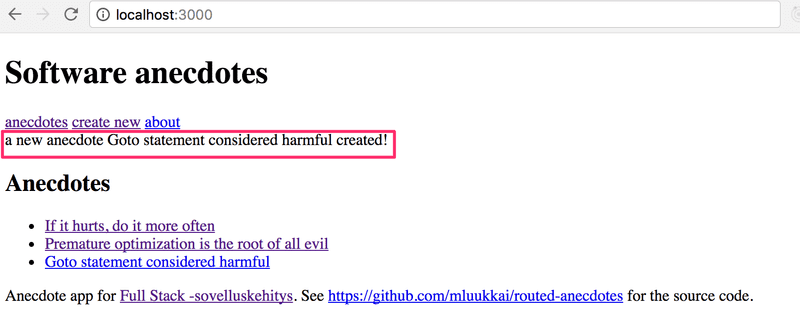
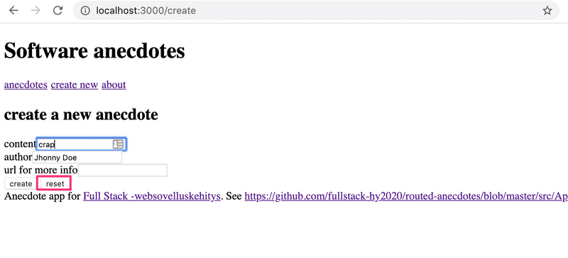
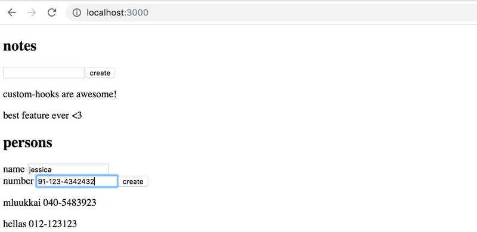
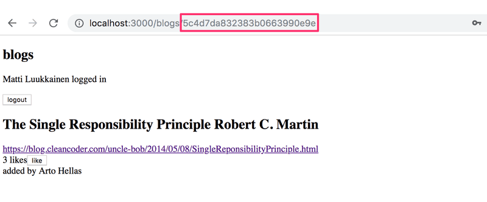
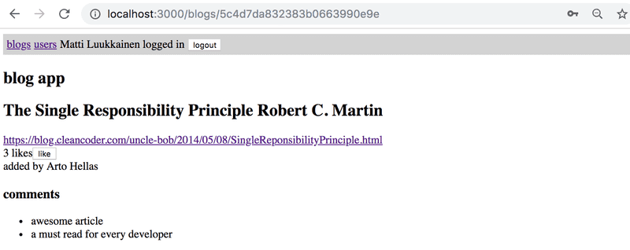
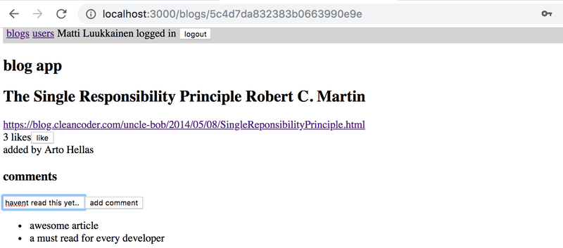

# Full Stack Open - Part 7 - React router, custom hooks, styling app with CSS and webpack - Exercises


## Exercises 7.1.-7.3.

Let's return to working with anecdotes. Use the redux-free anecdote app found in the repository https://github.com/fullstack-hy2020/routed-anecdotes as the starting point for the exercises.

If you clone the project into an existing git repository, remember to delete the git configuration of the cloned application:

```
cd routed-anecdotes   // go first to directory of the cloned repository
rm -rf .git
```

The application starts the usual way, but first, you need to install the dependencies of the application:

```
npm install
npm start
```

### 7.1: routed anecdotes, step1

Add React Router to the application so that by clicking links in the Menu component the view can be changed.

At the root of the application, meaning the path /, show the list of anecdotes:



The Footer component should always be visible at the bottom.

The creation of a new anecdote should happen e.g. in the path create:


### 7.2: routed anecdotes, step2

Implement a view for showing a single anecdote:


Navigating to the page showing the single anecdote is done by clicking the name of that anecdote:


### 7.3: routed anecdotes, step3

The default functionality of the creation form is quite confusing because nothing seems to be happening after creating a new anecdote using the form.

Improve the functionality such that after creating a new anecdote the application transitions automatically to showing the view for all anecdotes and the user is shown a notification informing them of this successful creation for the next five seconds:




## Exercises 7.4.-7.8.

We'll continue with the app from exercises of the chapter react router.

### 7.4: anecdotes and hooks step1

Simplify the anecdote creation form of your application with the useField custom hook we defined earlier.

One natural place to save the custom hooks of your application is in the /src/hooks/index.js file.

If you use the named export instead of the default export:

```
import { useState } from 'react'

export const useField = (type) => {  const [value, setValue] = useState('')

  const onChange = (event) => {
    setValue(event.target.value)
  }

  return {
    type,
    value,
    onChange
  }
}

// modules can have several named exports
export const useAnotherHook = () => {  // ...
}
```

Then importing happens in the following way:

```
import  { useField } from './hooks'

const App = () => {
  // ...
  const username = useField('text')
  // ...
}
```

### 7.5: anecdotes and hooks step2

Add a button to the form that you can use to clear all the input fields:



Expand the functionality of the useField hook so that it offers a new reset operation for clearing the field.

Depending on your solution, you may see the following warning in your console:


We will return to this warning in the next exercise.

### 7.6: anecdotes and hooks step3

If your solution did not cause a warning to appear in the console, you have already finished this exercise.

If you see the warning in the console, make the necessary changes to get rid of the Invalid value for prop `reset` on <input> tag console warning.

The reason for this warning is that after making the changes to your application, the following expression:

```
<input {...content}/>
```

Essentially, is the same as this:

```
<input
  value={content.value} 
  type={content.type}
  onChange={content.onChange}
  reset={content.reset}
/>
```

The input element should not be given a reset attribute.

One simple fix would be to not use the spread syntax and write all of the forms like this:

```
<input
  value={username.value} 
  type={username.type}
  onChange={username.onChange}
/>
```

If we were to do this, we would lose much of the benefit provided by the useField hook. Instead, come up with a solution that fixes the issue, but is still easy to use with spread syntax.

### 7.7: country hook

Let's return to exercises 2.18-2.20.

Use the code from https://github.com/fullstack-hy2020/country-hook as your starting point.

The application can be used to search for a country's details from the service in https://studies.cs.helsinki.fi/restcountries/. If a country is found, the details of the country are displayed:


If no country is found, a message is displayed to the user:


The application is otherwise complete, but in this exercise, you have to implement a custom hook useCountry, which can be used to search for the details of the country given to the hook as a parameter.

Use the API endpoint name to fetch a country's details in a useEffect hook within your custom hook.

Note that in this exercise it is essential to use useEffect's second parameter array to control when the effect function is executed. See the course part 2 for more info how the second parameter could be used.

### 7.8: ultimate hooks

The code of the application responsible for communicating with the backend of the note application of the previous parts looks like this:

```
import axios from 'axios'
const baseUrl = '/api/notes'

let token = null

const setToken = newToken => {
  token = `bearer ${newToken}`
}

const getAll = async () => {
  const response = await axios.get(baseUrl)
  return response.data
}

const create = async newObject => {
  const config = {
    headers: { Authorization: token },
  }

  const response = await axios.post(baseUrl, newObject, config)
  return response.data
}

const update = async (id, newObject) => {
  const response = await axios.put(`${ baseUrl }/${id}`, newObject)
  return response.data
}

export default { getAll, create, update, setToken }
```

We notice that the code is in no way specific to the fact that our application deals with notes. Excluding the value of the baseUrl variable, the same code could be reused in the blog post application for dealing with the communication with the backend.

Extract the code for communicating with the backend into its own useResource hook. It is sufficient to implement fetching all resources and creating a new resource.

You can do the exercise for the project found in the https://github.com/fullstack-hy2020/ultimate-hooks repository. The App component for the project is the following:

```
const App = () => {
  const content = useField('text')
  const name = useField('text')
  const number = useField('text')

  const [notes, noteService] = useResource('http://localhost:3005/notes')
  const [persons, personService] = useResource('http://localhost:3005/persons')

  const handleNoteSubmit = (event) => {
    event.preventDefault()
    noteService.create({ content: content.value })
  }
 
  const handlePersonSubmit = (event) => {
    event.preventDefault()
    personService.create({ name: name.value, number: number.value})
  }

  return (
    <div>
      <h2>notes</h2>
      <form onSubmit={handleNoteSubmit}>
        <input {...content} />
        <button>create</button>
      </form>
      {notes.map(n => <p key={n.id}>{n.content}</p>)}

      <h2>persons</h2>
      <form onSubmit={handlePersonSubmit}>
        name <input {...name} /> <br/>
        number <input {...number} />
        <button>create</button>
      </form>
      {persons.map(n => <p key={n.id}>{n.name} {n.number}</p>)}
    </div>
  )
}
```

The useResource custom hook returns an array of two items just like the state hooks. The first item of the array contains all of the individual resources and the second item of the array is an object that can be used for manipulating the resource collection, like creating new ones.

If you implement the hook correctly, it can be used for both notes and phone numbers (start the server with the npm run server command at port 3005).




## Exercises 7.9.-7.21.

### 7.9: automatic code formatting

In the previous parts, we used ESLint to ensure that code follows the defined conventions. Prettier is yet another approach for the same. According to the documentation, Prettier is an opinionated code formatter, that is, Prettier not only controls the code style but also formats the code according to the definition.

Prettier is easy to integrate into the code editor so that when the code is saved, it is automatically formatted correctly.

Take Prettier to use in your app and configure it to work with your editor.

### State management: Redux

There are two alternative versions to choose for exercises 7.10-7.13: you can do the state management of the application either using Redux or React Query and Context. If you want to maximize your learning, you should do both versions!

### 7.10: Redux, step1

Refactor the application to use Redux to manage the notification data.

### 7.11: Redux, step2

Note that this and the next two exercises are quite laborious but incredibly educational.

Store the information about blog posts in the Redux store. In this exercise, it is enough that you can see the blogs in the backend and create a new blog.

You are free to manage the state for logging in and creating new blog posts by using the internal state of React components.

### 7.12: Redux, step3

Expand your solution so that it is again possible to like and delete a blog.

### 7.13: Redux, step4

Store the information about the signed-in user in the Redux store.

### State management: React Query and context

There are two alternative versions to choose for exercises 7.10-7.13: you can do the state management of the application either using Redux or React Query and Context.

### 7.10: React Query and context step1

Refactor the app to use the useReducer-hook and context to manage the notification data.

### 7.11: React Query and context step2

Use React Query to manage the state for blogs. For this exercise, it is sufficient that the application displays existing blogs and that the creation of a new blog is successful.

You are free to manage the state for logging in and creating new blog posts by using the internal state of React components.

### 7.12: React Query and context step3

Expand your solution so that it is again possible to like and delete a blog.

### 7.13: React Query and context step4

Use the useReducer-hook and context to manage the data for the logged in user.

### Views

The rest of the tasks are common to both the Redux and React Query versions.

### 7.14: Users view

Implement a view to the application that displays all of the basic information related to users:


### 7.15: Individual user view

Implement a view for individual users that displays all of the blog posts added by that user:


You can access the view by clicking the name of the user in the view that lists all users:


NB: you will almost certainly stumble across the following error message during this exercise:


The error message will occur if you refresh the page for an individual user.

The cause of the issue is that, when we navigate directly to the page of an individual user, the React application has not yet received the data from the backend. One solution for fixing the problem is to use conditional rendering:

```
const User = () => {
  const user = ...
  if (!user) {    return null  }
  return (
    <div>
      // ...
    </div>
  )
}
```

### 7.16: Blog view

Implement a separate view for blog posts. You can model the layout of your view after the following example:



Users should be able to access the view by clicking the name of the blog post in the view that lists all of the blog posts.


After you're done with this exercise, the functionality that was implemented in exercise 5.7 is no longer necessary. Clicking a blog post no longer needs to expand the item in the list and display the details of the blog post.

### 7.17: Navigation

Implement a navigation menu for the application:


### 7.18: comments, step1

Implement the functionality for commenting on blog posts:



Comments should be anonymous, meaning that they are not associated with the user who left the comment.

In this exercise, it is enough for the frontend to only display the comments that the application receives from the backend.

An appropriate mechanism for adding comments to a blog post would be an HTTP POST request to the api/blogs/:id/comments endpoint.

### 7.19: comments, step2

Extend your application so that users can add comments to blog posts from the frontend:



### 7.20: Styles, step1

Improve the appearance of your application by applying one of the methods shown in the course material.

### 7.21: Styles, step2

You can mark this exercise as finished if you use an hour or more for styling your application.

This was the last exercise for this part of the course and it's time to push your code to GitHub and mark all of your finished exercises to the exercise submission system.


