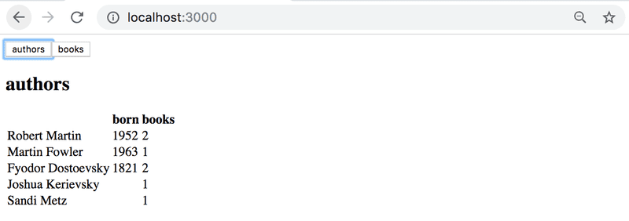
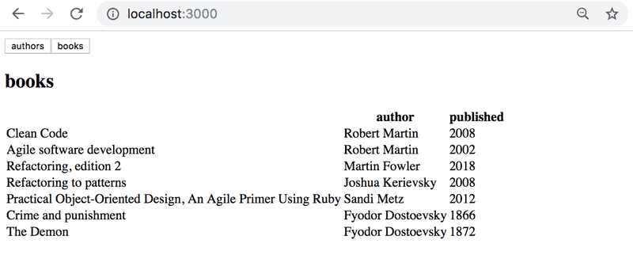
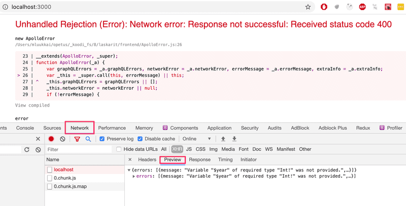
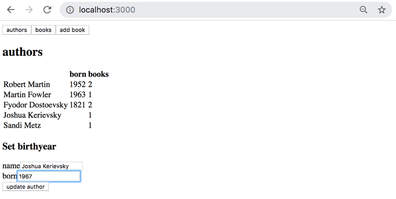

# Full Stack Open - Part 8 - GraphQL - Exercises


## Exercises 8.1.-8.7.

Through the exercises, we will implement a GraphQL backend for a small library. Start with [this file](https://github.com/fullstack-hy2020/misc/blob/master/library-backend.js). Remember to `npm init` and to install dependencies!

### 8.1: The number of books and authors

Implement queries `bookCount` and `authorCount` which return the number of books and the number of authors.

The query

```
query {
  bookCount
  authorCount
}
```

should return

```
{
  "data": {
    "bookCount": 7,
    "authorCount": 5
  }
}
```

### 8.2: All books

Implement query `allBooks`, which returns the details of all books.

In the end, the user should be able to do the following query:

```
query {
  allBooks { 
    title 
    author
    published 
    genres
  }
}
```

### 8.3: All authors

Implement query `allAuthors`, which returns the details of all authors. The response should include a field `bookCount` containing the number of books the author has written.

For example the query

```
query {
  allAuthors {
    name
    bookCount
  }
}
```

should return

```
{
  "data": {
    "allAuthors": [
      {
        "name": "Robert Martin",
        "bookCount": 2
      },
      {
        "name": "Martin Fowler",
        "bookCount": 1
      },
      {
        "name": "Fyodor Dostoevsky",
        "bookCount": 2
      },
      {
        "name": "Joshua Kerievsky",
        "bookCount": 1
      },
      {
        "name": "Sandi Metz",
        "bookCount": 1
      }
    ]
  }
}
```

### 8.4: Books of an author

Modify the `allBooks` query so that a user can give an optional parameter <em>author</em>. The response should include only books written by that author.

For example query

```
query {
  allBooks(author: "Robert Martin") {
    title
  }
}
```

should return

```
{
  "data": {
    "allBooks": [
      {
        "title": "Clean Code"
      },
      {
        "title": "Agile software development"
      }
    ]
  }
}
```

### 8.5: Books by genre

Modify the query `allBooks` so that a user can give an optional parameter <em>genre</em>. The response should include only books of that genre.

For example query

```
query {
  allBooks(genre: "refactoring") {
    title
    author
  }
}
```

should return

```
{
  "data": {
    "allBooks": [
      {
        "title": "Clean Code",
        "author": "Robert Martin"
      },
      {
        "title": "Refactoring, edition 2",
        "author": "Martin Fowler"
      },
      {
        "title": "Refactoring to patterns",
        "author": "Joshua Kerievsky"
      },
      {
        "title": "Practical Object-Oriented Design, An Agile Primer Using Ruby",
        "author": "Sandi Metz"
      }
    ]
  }
}
```

The query must work when both optional parameters are given:

```
query {
  allBooks(author: "Robert Martin", genre: "refactoring") {
    title
    author
  }
}
```

### 8.6: Adding a book

Implement mutation `addBook`, which can be used like this:

```
mutation {
  addBook(
    title: "NoSQL Distilled",
    author: "Martin Fowler",
    published: 2012,
    genres: ["database", "nosql"]
  ) {
    title,
    author
  }
}
```

The mutation works even if the author is not already saved to the server:

```
mutation {
  addBook(
    title: "Pimeyden tango",
    author: "Reijo Mäki",
    published: 1997,
    genres: ["crime"]
  ) {
    title,
    author
  }
}
```

If the author is not yet saved to the server, a new author is added to the system. The birth years of authors are not saved to the server yet, so the query

```
query {
  allAuthors {
    name
    born
    bookCount
  }
}
```

returns

```
{
  "data": {
    "allAuthors": [
      // ...
      {
        "name": "Reijo Mäki",
        "born": null,
        "bookCount": 1
      }
    ]
  }
}
```

### 8.7: Updating the birth year of an author

Implement mutation `editAuthor`, which can be used to set a birth year for an author. The mutation is used like so:

```
mutation {
  editAuthor(name: "Reijo Mäki", setBornTo: 1958) {
    name
    born
  }
}
```

If the correct author is found, the operation returns the edited author:

```
{
  "data": {
    "editAuthor": {
      "name": "Reijo Mäki",
      "born": 1958
    }
  }
}
```

If the author is not in the system, <em>null</em> is returned:

```
{
  "data": {
    "editAuthor": null
  }
}
```


## Exercises 8.8.-8.12.

Through these exercises, we'll implement a frontend for the GraphQL library.

Take [this project](https://github.com/fullstack-hy2020/library-frontend) as a start for your application.

**Note:** if you want, you can also use [React router](https://fullstackopen.com/en/part7/react_router) to implement the application's navigation!

### 8.8: Authors view

Implement an Authors view to show the details of all authors on a page as follows:



### 8.9: Books view

Implement a Books view to show on a page all other details of all books except their genres.



### 8.10: Adding a book

Implement a possibility to add new books to your application. The functionality can look like this:


Make sure that the Authors and Books views are kept up to date after a new book is added.

In case of problems when making queries or mutations, check from the developer console what the server response is:



### 8.11: Authors birth year

Implement a possibility to set authors birth year. You can create a new view for setting the birth year, or place it on the Authors view:



Make sure that the Authors view is kept up to date after setting a birth year.

### 8.12: Authors birth year advanced

Change the birth year form so that a birth year can be set only for an existing author. Use [select tag](https://legacy.reactjs.org/docs/forms.html#the-select-tag), [react select](https://github.com/JedWatson/react-select), or some other mechanism.

A solution using the react select library looks as follows:


## Exercises 8.13.-8.16.

The following exercises are quite likely to break your frontend. Do not worry about it yet; the frontend shall be fixed and expanded in the next chapter.

### 8.13: Database, part 1

Change the library application so that it saves the data to a database. You can find the <em>mongoose schema</em> for books and authors from [here](https://github.com/fullstack-hy/misc/blob/main/library-schema.md).

Let's change the book graphql schema a little

```
type Book {
  title: String!
  published: Int!

  author: Author!
  genres: [String!]!
  id: ID!
}
```

so that instead of just the author's name, the book object contains all the details of the author.

You can assume that the user will not try to add faulty books or authors, so you don't have to care about validation errors.

The following things do not have to work just yet:

  *  `allBooks` query with parameters
  *  `bookCount` field of an author object
  *  `author` field of a book
  *  `editAuthor` mutation

**Note:** despite the fact that author is now an object within a book, the schema for adding a book can remain same, only the name of the author is given as a parameter

```
type Mutation {
  addBook(
    title: String!

    author: String!
    published: Int!
    genres: [String!]!
  ): Book!
  editAuthor(name: String!, setBornTo: Int!): Author
}
```

### 8.14: Database, part 2

Complete the program so that all queries (to get `allBooks` working with the parameter `author` and `bookCount` field of an author object is not required) and mutations work.

Regarding the <em>genre</em> parameter of the all books query, the situation is a bit more challenging. The solution is simple, but finding it can be a headache. You might benefit from [this](https://www.mongodb.com/docs/manual/tutorial/query-array-of-documents/).

### 8.15: Database, part 3

Complete the program so that database validation errors (e.g. book title or author name being too short) are handled sensibly. This means that they cause [GraphQLError](https://www.apollographql.com/docs/apollo-server/data/errors/#custom-errors) with a suitable error message to be thrown.

### 8.16: user and logging in

Add user management to your application. Expand the schema like so:

```
type User {
  username: String!
  favoriteGenre: String!
  id: ID!
}

type Token {
  value: String!
}

type Query {
  // ..
  me: User
}

type Mutation {
  // ...
  createUser(
    username: String!
    favoriteGenre: String!
  ): User
  login(
    username: String!
    password: String!
  ): Token
}
```

Create resolvers for query `me` and the new mutations `createUser` and `login`. Like in the course material, you can assume all users have the same hardcoded password.

Make the mutations `addBook` and `editAuthor` possible only if the request includes a valid token.

(Don't worry about fixing the frontend for the moment.)


## Exercises 8.17.-8.22.

### 8.17: Listing books

After the backend changes, the list of books does not work anymore. Fix it.

### 8.18: Log in

Adding new books and changing the birth year of an author do not work because they require a user to be logged in.

Implement login functionality and fix the mutations.

It is not necessary yet to handle validation errors.

You can decide how the login looks on the user interface. One possible solution is to make the login form into a separate view which can be accessed through a navigation menu:


The login form:


When a user is logged in, the navigation changes to show the functionalities which can only be done by a logged-in user:


### 8.19: Books by genre, part 1

Complete your application to filter the book list by genre. Your solution might look something like this:


In this exercise, the filtering can be done using just React.

### 8.20: Books by genre, part 2

Implement a view which shows all the books based on the logged-in user's favourite genre.


### 8.21: books by genre with GraphQL

In the previous two exercises, the filtering could have been done using just React. To complete this exercise, you should redo the filtering the books based on a selected genre (that was done in exercise 8.19) using a GraphQL query to the server. If you already did so then you do not have to do anything.

This and the next exercises are quite **challenging** like it should be this late in the course. You might want to complete first the easier ones in the [next part](https://fullstackopen.com/en/part8/fragments_and_subscriptions).

### 8.22: Up-to-date cache and book recommendations

If you did the previous exercise, that is, fetch the books in a genre with GraphQL, ensure somehow that the books view is kept up to date. So when a new book is added, the books view is updated **at least** when a genre selection button is pressed.

<em>When new genre selection is not done, the view does not have to be updated.</em>


## Exercises 8.23.-8.26.

### 8.23: Subscriptions - server

Do a backend implementation for subscription `bookAdded`, which returns the details of all new books to its subscribers.

### 8.24: Subscriptions - client, part 1

Start using subscriptions in the client, and subscribe to bookAdded. When new books are added, notify the user. Any method works. For example, you can use the [window.alert](https://developer.mozilla.org/en-US/docs/Web/API/Window/alert) function.

### 8.25: Subscriptions - client, part 2

Keep the application's book view updated when the server notifies about new books (you can ignore the author view!). You can test your implementation by opening the app in two browser tabs and adding a new book in one tab. Adding the new book should update the view in both tabs.

### 8.26: n+1

Solve the n+1 problem of the following query using any method you like.

```
query {
  allAuthors {
    name 
    bookCount
  }
}
```

### Submitting exercises and getting the credits

Exercises of this part are submitted via [the submissions system](https://studies.cs.helsinki.fi/stats/courses/fs-graphql) just like in the previous parts, but unlike previous parts, the submission goes to different "course instance". Remember that you have to finish at least 22 exercises to pass this part!

Once you have completed the exercises and want to get the credits, let us know through the exercise submission system that you have completed the course:


**Note:** that you need a registration to the corresponding course part for getting the credits registered, see [here](https://fullstackopen.com/en/part0/general_info#parts-and-completion) for more information.

You can download the certificate for completing this part by clicking one of the flag icons. The flag icon corresponds to the certificate's language.


