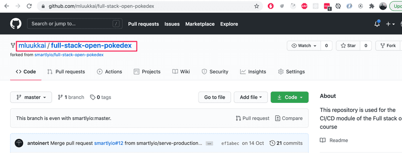
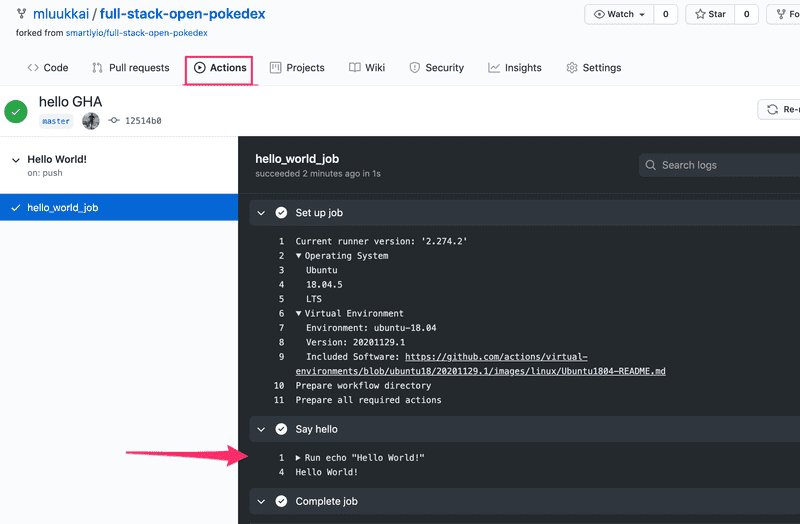
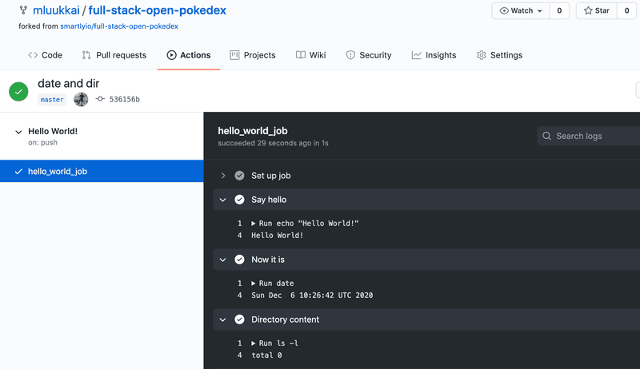
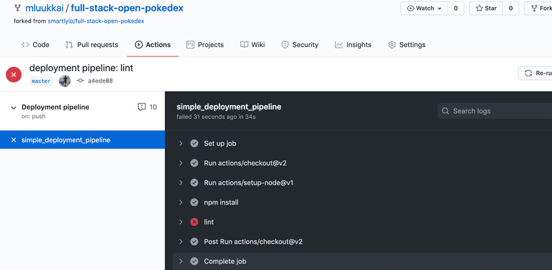
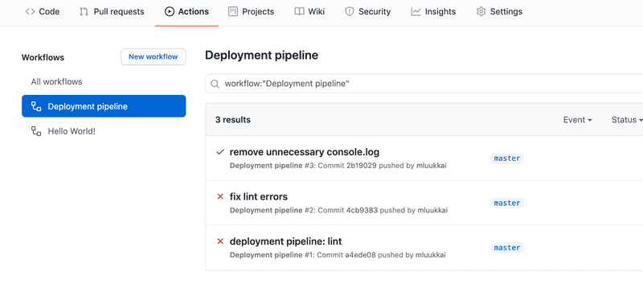
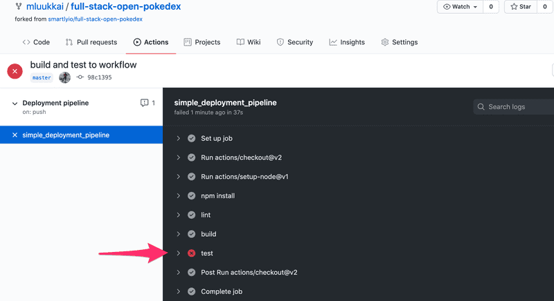
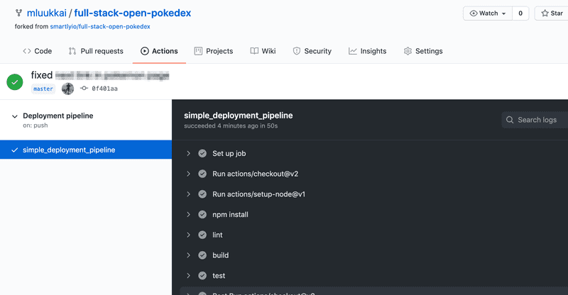
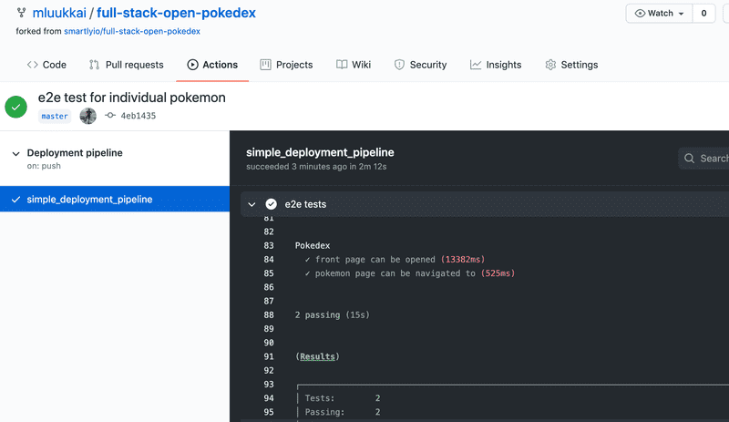

# Full Stack Open - Part 11 - CI/CD - Exercises


## Exercise 11.1.

Before getting our hands dirty with setting up the CI/CD pipeline let us reflect a bit on what we have read. 

### 11.1: Warming up

Think about a hypothetical situation where we have an application being worked on by a team of about 6 people. The application is in active development and will be released soon.

Let us assume that the application is coded with some other language than JavaScript/TypeScript, e.g. in Python, Java, or Ruby. You can freely pick the language. This might even be a language you do not know much yourself.

Write a short text, say 200-300 words, where you answer or discuss some of the points below. You can check the length with [https://wordcounter.net/](https://wordcounter.net). Save your answer to the file named <em>exercise1.md</em> in the root of the repository that you shall create in [exercise 11.2](https://fullstackopen.com/en/part11/getting_started_with_git_hub_actions#exercise-11-2).

The points to discuss:

  *  Some common steps in a CI setup include <em>linting</em>, <em>testing</em>, and <em>building</em>. What are the specific tools for taking care of these steps in the ecosystem of the language you picked? You can search for the answers by google.
  *  What alternatives are there to set up the CI besides Jenkins and GitHub Actions? Again, you can ask google!
  *  Would this setup be better in a self-hosted or a cloud-based environment? Why? What information would you need to make that decision?

Remember that there are no 'right' answers to the above! 


## Exercise 11.2.

In most exercises of this part, we are building a CI/CD pipeline for a small project found in this example [project repository](https://github.com/smartlyio/full-stack-open-pokedex).

### 11.2: The example project

The first thing you'll want to do is to fork the example repository under your name. What it essentially does is it creates a copy of the repository under your GitHub user profile for your use.

To fork the repository, you can click on the Fork button in the top-right area of the repository view next to the Star button:


Once you've clicked on the Fork button, GitHub will start the creation of a new repository called `{github_username}/full-stack-open-pokedex`.

Once the process has been finished, you should be redirected to your brand new repository:



Clone the project now to your machine. As always, when starting with a new code, the most obvious place to look first is the file `package.json`.

**Note:** <em>Since the project is already a bit old, you need Node 16 to work with it!</em>

Try now the following:

  *  install dependencies (by running `npm install`)
  *  start the code in development mode
  *  run tests
  *  lint the code

You might notice that project contains some broken tests and linting errors. **Just leave them as they are for now**. We will get around those later in the exercises.

As you might remember from [Part 3](https://fullstackopen.com/en/part3/deploying_app_to_internet#frontend-production-build), the React code <em>should not</em> be run in development mode once it is deployed in production. Try now the following

  *  create a production <em>build</em> of the project
  *  run the production version locally

Also for these two tasks, there are ready-made npm scripts in the project!

Study the structure of the project for a while. As you notice both the frontend and the backend code is now in the [same repository](https://fullstackopen.com/en/part7/class_components_miscellaneous#frontend-and-backend-in-the-same-repository). In earlier parts of the course we had a separate repository for both, but having those in the same repository makes things much simpler when setting up a CI environment.

In contrast to most projects in this course, the frontend code <em>does not use</em> create-react-app, but it has a relatively simple [webpack](https://fullstackopen.com/en/part7/webpack) configuration that takes care of creating the development environment and creating the production bundle.


## Exercises 11.3.-11.4.

To tie this all together, let us now get GitHub Actions up and running in the example project!

### 11.3: Hello world!

Create a new Workflow which outputs "Hello World!" to the user. For the setup, you should create the directory `.github/workflows` and a file `hello.yml` to your repository.

To see what your GitHub Action workflow has done, you can navigate to the **Actions** tab in GitHub where you should see the workflows in your repository and the steps they implement. The output of your Hello World workflow should look something like this with a properly configured workflow.



You should see the "Hello World!" message as an output. If that's the case then you have successfully gone through all the necessary steps. You have your first GitHub Actions workflow active!

Note that GitHub Actions also informs you on the exact environment (operating system, and its [setup](https://github.com/actions/runner-images/blob/ubuntu18/20201129.1/images/linux/Ubuntu1804-README.md)) where your workflow is run. This is important since if something surprising happens, it makes debugging so much easier if you can reproduce all the steps in your machine!

### 11.4: Date and directory contents

Extend the workflow with steps that print the date and current directory content in long format.

Both of these are easy steps, and just running commands [date](https://man7.org/linux/man-pages/man1/date.1.html) and [ls](https://man7.org/linux/man-pages/man1/ls.1.html) will do the trick.

Your workflow should now look like this



As the output of command `ls -l` shows, by default, the virtual environment that runs our workflow <em>does not</em> have any code!


## Exercises 11.5.-11.9.

### 11.5: Linting workflow

Implement or <em>copy-paste</em> the "Lint" workflow and commit it to the repository. Use a new <em>yml</em> file for this workflow, you may call it e.g. <em>pipeline.yml</em>.

Push your code and navigate to "Actions" tab and click on your newly created workflow on the left. You should see that the workflow run has failed:



## 11.6: Fix the code

There are some issues with the code that you will need to fix. Open up the workflow logs and investigate what is wrong.

A couple of hints. One of the errors is best to be fixed by specifying proper <em>env</em> for linting, see [here](https://fullstackopen.com/en/part3/validation_and_es_lint#lint) how it can be done. One of the complaints concerning `console.log` statement could be taken care of by simply silencing the rule for that specific line. Ask google how to do it.

Make the necessary changes to the source code so that the lint workflow passes. Once you commit new code the workflow will run again and you will see updated output where all is green again:



## 11.7: Building and testing

Let's expand on the previous workflow that currently does the linting of the code. Edit the workflow and similarly to the lint command add commands for build and test. After this step outcome should look like this



As you might have guessed, there are some problems in code...

## 11.8: Back to green

Investigate which test fails and fix the issue in the code (do not change the tests).

Once you have fixed all the issues and the Pokedex is bug-free, the workflow run will succeed and show green!



## 11.9: Simple end to end tests

The current set of tests use [Jest](https://jestjs.io/) to ensure that the React components work as intended. This is exactly the same thing that is done in section [Testing React apps](https://fullstackopen.com/en/part5/testing_react_apps) of Part 5.

Testing components in isolation is quite useful but that still does not ensure that the system as a whole works as we wish. To have more confidence about this, let us write a couple of really simple end to end tests with the [Cypress](https://www.cypress.io/) library similarly what we do in section [End to end testing](https://fullstackopen.com/en/part5/end_to_end_testing) of Part 5.

So, setup Cypress (you'll find [here](https://fullstackopen.com/en/part5/end_to_end_testing) all info you need) and use this test at first:

```
describe('Pokedex', function() {
  it('front page can be opened', function() {
    cy.visit('http://localhost:5000')
    cy.contains('ivysaur')
    cy.contains('Pokémon and Pokémon character names are trademarks of Nintendo.')
  })
})
```

Define a npm script `test:e2e` for running the e2e tests from the command line.

**NOTE:** Do not include the word <em>spec</em> in the Cypress test file name, that would cause also Jest to run it, and it might cause problems.

**Another thing to note** is that although the page renders the Pokemon names with an initial capital letter, the names are actually written with lower case letters in the source, so you should test for `ivysaur` instead of `Ivysaur`!

Ensure that the test passes locally. Remember that the Cypress tests <blockquote>assume that the application is up and running</blockquote> when you run the test! If you have forgotten the details (that happened to me too!), please see [Part 5](https://fullstackopen.com/en/part5/end_to_end_testing) how to get up and running with Cypress.

Once the end to end test works in your machine, include it in the GitHub Action workflow. By far the easiest way to do that is to use the ready-made action [cypress-io/github-action](https://github.com/cypress-io/github-action). The step that suits us is the following:

```
- name: e2e tests
  uses: cypress-io/github-action@v5
  with:
    command: npm run test:e2e
    start: npm run start-prod
    wait-on: http://localhost:5000
```

Three options are used: [command](https://github.com/cypress-io/github-action#custom-test-command) specifies how to run Cypress tests, [start](https://github.com/cypress-io/github-action#start-server) gives npm script that starts the server, and [wait-on](https://github.com/cypress-io/github-action#wait-on) says that before the tests are run, the server should have started on url [http://localhost:5000](localhost:5000/).

Once you are sure that the pipeline works, <em>write another test</em> that ensures that one can navigate from the main page to the page of a particular Pokemon, e.g. <em>ivysaur</em>. The test does not need to be a complex one, just check that when you navigate to a link, the page has some proper content, such as the string <em>chlorophyll</em> in the case of <em>ivysaur</em>.

**NOTE:** The Pokemon abilities are written with lower case letters in the source code (the capitalization is done in CSS), so <em>do not</em> test for <em>Chlorophyll</em> but rather <em>chlorophyll</em>.

**NOTE 2:** That you should not try <em>bulbasaur</em>, for some reason the page of that particular Pokemon does not work properly...

The end result should be something like this



End to end tests are nice since they give us confidence that software works from the end user's perspective. The price we have to pay is the slower feedback time. Now executing the whole workflow takes quite much longer.

