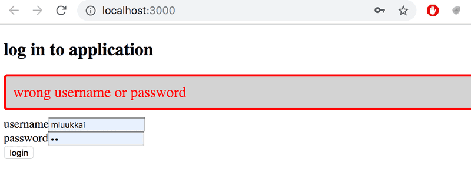
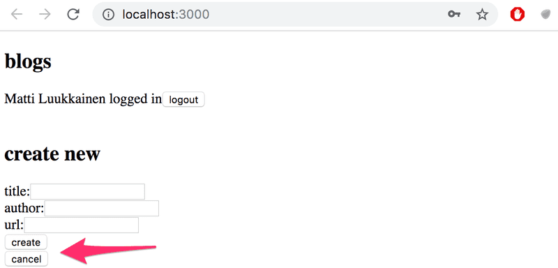
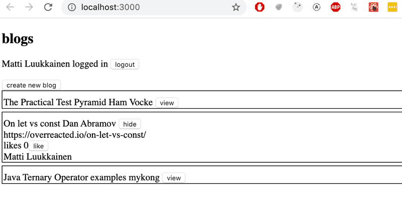
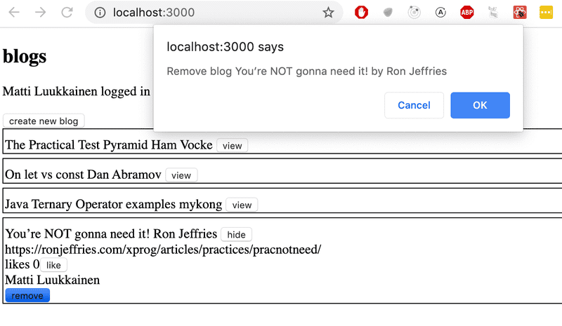

# Full Stack Open - Part 5 - Testing React apps - Exercises


## Exercises 5.1.-5.4.

We will now create a frontend for the bloglist backend we created in the last part. You can use this [application](https://github.com/fullstack-hy2020/bloglist-frontend) from GitHub as the base of your solution. The application expects your backend to be running on port 3003.

It is enough to submit your finished solution. You can do a commit after each exercise, but that is not necessary.

The first few exercises revise everything we have learned about React so far. They can be challenging, especially if your backend is incomplete. It might be best to use the backend that we marked as the answer for part 4.

While doing the exercises, remember all of the debugging methods we have talked about, especially keeping an eye on the console.

**Warning:** If you notice you are mixing in the functions `async/await` and `then` commands, it's 99.9% certain you are doing something wrong. Use either or, never both.

### 5.1: Bloglist frontend, step1

Clone the application from [GitHub](https://github.com/fullstack-hy2020/bloglist-frontend) with the command:

```
git clone https://github.com/fullstack-hy2020/bloglist-frontend
```

<em>remove the git configuration of the cloned application</em>:

```
cd bloglist-frontend   // go to cloned repository
rm -rf .git
```

The application is started the usual way, but you have to install its dependencies first:

```
npm install
npm start
```

Implement login functionality to the frontend. The token returned with a successful login is saved to the application's state <em>user</em>.

If a user is not logged in, <em>only</em> the login form is visible.


If the user is logged-in, the name of the user and a list of blogs is shown.


User details of the logged-in user do not have to be saved to the local storage yet.

**NB:** You can implement the conditional rendering of the login form like this for example:

```
  if (user === null) {
    return (
      <div>
        <h2>Log in to application</h2>
        <form>
          //...
        </form>
      </div>
    )
  }

  return (
    <div>
      <h2>blogs</h2>
      {blogs.map(blog =>
        <Blog key={blog.id} blog={blog} />
      )}
    </div>
  )
}
```

### 5.2: Bloglist frontend, step2

Make the login 'permanent' by using the local storage. Also, implement a way to log out.


Ensure the browser does not remember the details of the user after logging out.

### 5.3: Bloglist frontend, step3

Expand your application to allow a logged-in user to add new blogs:


### 5.4: Bloglist frontend, step4

Implement notifications that inform the user about successful and unsuccessful operations at the top of the page. For example, when a new blog is added, the following notification can be shown:


Failed login can show the following notification:



The notifications must be visible for a few seconds. It is not compulsory to add colors.


## Exercises 5.5.-5.11.

### 5.5 Bloglist frontend, step5

Change the form for creating blog posts so that it is only displayed when appropriate. Use functionality similar to what was shown [earlier in this part](https://fullstackopen.com/en/part5/props_children_and_proptypes#displaying-the-login-form-only-when-appropriate) of the course material. If you wish to do so, you can use the <em>Togglable</em> component defined in part 5.

By default the form is not visible


It expands when button <em>create new blog</em> is clicked



The form closes when a new blog is created.

### 5.6 Bloglist frontend, step6

Separate the form for creating a new blog into its own component (if you have not already done so), and move all the states required for creating a new blog to this component.

The component must work like the <em>NoteForm</em> component from the [material](https://fullstackopen.com/en/part5/props_children_and_proptypes) of this part.

### 5.7 Bloglist frontend, step7

Let's add a button to each blog, which controls whether all of the details about the blog are shown or not.

Full details of the blog open when the button is clicked.



And the details are hidden when the button is clicked again.

At this point, the <em>like</em> button does not need to do anything.

The application shown in the picture has a bit of additional CSS to improve its appearance.

It is easy to add styles to the application as shown in Part 2 using [inline](https://fullstackopen.com/en/part2/adding_styles_to_react_app#inline-styles) styles:

```
const Blog = ({ blog }) => {
  const blogStyle = {
    paddingTop: 10,
    paddingLeft: 2,
    border: 'solid',
    borderWidth: 1,
    marginBottom: 5
  }

  return (
    <div style={blogStyle}>      <div>
        {blog.title} {blog.author}
      </div>
      // ...
  </div>
)}
```

**NB:** Even though the functionality implemented in this part is almost identical to the functionality provided by the <em>Togglable</em> component, the component can not be used directly to achieve the desired behavior. The easiest solution will be to add a state to the blog post that controls the displayed form of the blog post.

### 5.8: Bloglist frontend, step8

We notice that something is wrong. When a new blog is created in the app, the name of the user that added the blog is not shown in the details of the blog:


When the browser is reloaded, the information of the person is displayed. This is not acceptable, find out where the problem is and make the necessary correction.

### 5.9: Bloglist frontend, step9

Implement the functionality for the like button. Likes are increased by making an HTTP `PUT` request to the unique address of the blog post in the backend.

Since the backend operation replaces the entire blog post, you will have to send all of its fields in the request body. If you wanted to add a like to the following blog post:

```
{
  _id: "5a43fde2cbd20b12a2c34e91",
  user: {
    _id: "5a43e6b6c37f3d065eaaa581",
    username: "mluukkai",
    name: "Matti Luukkainen"
  },
  likes: 0,
  author: "Joel Spolsky",
  title: "The Joel Test: 12 Steps to Better Code",
  url: "https://www.joelonsoftware.com/2000/08/09/the-joel-test-12-steps-to-better-code/"
},
```

You would have to make an HTTP PUT request to the address <em>/api/blogs/5a43fde2cbd20b12a2c34e91</em> with the following request data:

```
{
  user: "5a43e6b6c37f3d065eaaa581",
  likes: 1,
  author: "Joel Spolsky",
  title: "The Joel Test: 12 Steps to Better Code",
  url: "https://www.joelonsoftware.com/2000/08/09/the-joel-test-12-steps-to-better-code/"
}
```

The backend has to be updated too to handle the user reference.

**One last warning:** If you notice that you are using `async/await` and the `then`-method in the same code, it is almost certain that you are doing something wrong. Stick to using one or the other, and never use both at the same time "just in case".

### 5.10: Bloglist frontend, step10

Modify the application to list the blog posts by the number of <em>likes</em>. Sorting the blog posts can be done with the array [sort](https://developer.mozilla.org/en-US/docs/Web/JavaScript/Reference/Global_Objects/Array/sort) method.

### 5.11: Bloglist frontend, step11

Add a new button for deleting blog posts. Also, implement the logic for deleting blog posts in the frontend.

Your application could look something like this:



The confirmation dialog for deleting a blog post is easy to implement with the [window.confirm](https://developer.mozilla.org/en-US/docs/Web/API/Window/confirm) function.

Show the button for deleting a blog post only if the blog post was added by the user.


## Exercise 5.12.

### 5.12: Bloglist frontend, step12

Define PropTypes for one of the components of your application, and add ESlint to the project. Define the configuration according to your liking. Fix all of the linter errors.

`create-react-app` has installed ESlint to the project by default, so all that's left for you to do is define your desired configuration in the <em>.eslintrc.js</em> file.

**NB:** Do not run the `eslint --init` command. It will install the latest version of ESlint that is not compatible with the configuration file created by `create-react-app`!


## Exercises 5.13.-5.16.

### 5.13: Bloglist tests, step1

Make a test, which checks that the component displaying a blog renders the blog's title and author, but does not render its URL or number of likes by default.

Add CSS classes to the component to help the testing as necessary.

### 5.14: Bloglist tests, step2

Make a test, which checks that the blog's URL and number of likes are shown when the button controlling the shown details has been clicked.

### 5.15: Bloglist tests, step3

Make a test, which ensures that if the <em>like</em> button is clicked twice, the event handler the component received as props is called twice.

### 5.16: Bloglist tests, step4

Make a test for the new blog form. The test should check, that the form calls the event handler it received as props with the right details when a new blog is created. 


## Exercises 5.17.-5.23.

In the last exercises of this part, we will do some E2E tests for our blog application. The material of this part should be enough to complete the exercises. **You must check out the Cypress [documentation](https://docs.cypress.io/guides/overview/why-cypress#In-a-nutshell)**. It is probably the best documentation I have ever seen for an open-source project.

I especially recommend reading [Introduction to Cypress](https://docs.cypress.io/guides/core-concepts/introduction-to-cypress#Cypress-Can-Be-Simple-Sometimes), which states

<blockquote><em>This is the single most important guide for understanding how to test with Cypress. Read it. Understand it.</em></blockquote>

### 5.17: Bloglist end to end testing, step1

Configure Cypress for your project. Make a test for checking that the application displays the login form by default.

The structure of the test must be as follows:

```
describe('Blog app', function() {
  beforeEach(function() {
    cy.request('POST', 'http://localhost:3003/api/testing/reset')
    cy.visit('http://localhost:3000')
  })

  it('Login form is shown', function() {
    // ...
  })
})
```

The <em>beforeEach</em> formatting blog must empty the database using for example the method we used in the [material](https://fullstackopen.com/en/part5/end_to_end_testing#controlling-the-state-of-the-database).

### 5.18: Bloglist end to end testing, step2

Make tests for logging in. Test both successful and unsuccessful login attempts. Make a new user in the <em>beforeEach</em> block for the tests.

The test structure extends like so:

```
describe('Blog app', function() {
  beforeEach(function() {
    cy.request('POST', 'http://localhost:3003/api/testing/reset')
    // create here a user to backend
    cy.visit('http://localhost:3000')
  })

  it('Login form is shown', function() {
    // ...
  })

  describe('Login',function() {
    it('succeeds with correct credentials', function() {
      // ...
    })

    it('fails with wrong credentials', function() {
      // ...
    })
  })
})
```

<em>Optional bonus exercise</em>: Check that the notification shown with unsuccessful login is displayed red.

### 5.19: Bloglist end to end testing, step3

Make a test that verifies a logged-in user can create a new blog. The structure of the test could be as follows:

```
describe('Blog app', function() {
  // ...

  describe('When logged in', function() {
    beforeEach(function() {
      // log in user here
    })

    it('A blog can be created', function() {
      // ...
    })
  })

})
```

The test has to ensure that a new blog is added to the list of all blogs.

### 5.20: Bloglist end to end testing, step4

Make a test that confirms users can like a blog.

### 5.21: Bloglist end to end testing, step5

Make a test for ensuring that the user who created a blog can delete it.

### 5.22: Bloglist end to end testing, step6

Make a test for ensuring that only the creator can see the delete button of a blog, not anyone else.

### 5.23: Bloglist end to end testing, step7

Make a test that checks that the blogs are ordered according to likes with the blog with the most likes being first.

<em>This exercise is quite a bit trickier than the previous ones</em>. One solution is to add a certain class for the element which wraps the blog's content and use the [eq](https://docs.cypress.io/api/commands/eq#Syntax) method to get the blog element in a specific index:

```
cy.get('.blog').eq(0).should('contain', 'The title with the most likes')
cy.get('.blog').eq(1).should('contain', 'The title with the second most likes')
```

Note that you might end up having problems if you click a like button many times in a row. It might be that cypress does the clicking so fast that it does not have time to update the app state in between the clicks. One remedy for this is to wait for the number of likes to update in between all clicks.

This was the last exercise of this part, and it's time to push your code to GitHub and mark the exercises you completed in the exercise [submission system](https://studies.cs.helsinki.fi/stats/courses/fullstackopen).

